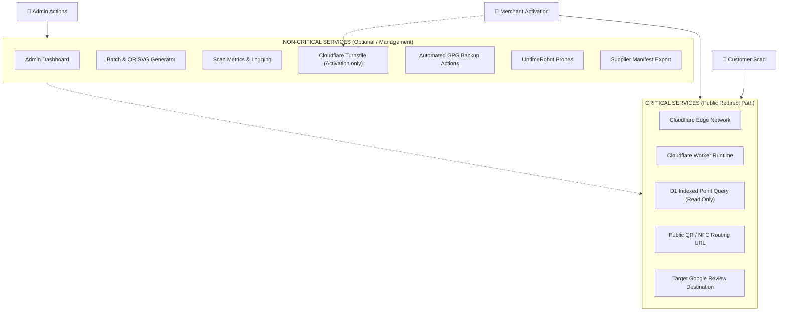

# 00 — Product Specification

> **Status:** Reconciled at Final Design Review (Gate 1.5). Implementation has NOT started.  
> **Branch:** `feature/qr-nfc-platform-design`  
> **Operating Rule:** $0/month initial pilot. Production-grade edge reliability.

---

## 1. Product Purpose & Scope

**QRoute** is a self-hosted dynamic QR and NFC routing platform designed specifically for physical Google Review cards.

It enables business owners to receive physical cards with a permanent QR/NFC identifier URL, activate their card once on their phone by entering their Google Review URL and a secret activation code, and permanently route customer scans directly to Google's official review form.

---

## 2. The Physical Card & Identifier Specification

### QR Code Content
The physical QR code encodes strictly the permanent public routing URL:
```
https://[DOMAIN]/c/A7K92P4X8Q
```
- **Invariant:** The QR code **never** contains the Google destination directly.
- **Invariant:** The QR code **never** contains the activation code.
- **Format:** 10 characters from Crockford's Base32 alphabet (`0-9`, `A-Z`, excluding `I`, `L`, `O`, `U`).

### Physical Activation Code
Printed as separate text on the reverse of the physical card:
```
K7XM-92PR-L8Q2
```
- **Format:** Three groups of 4 characters (`XXXX-XXXX-XXXX`).
- **Storage:** Stored exclusively as an HMAC-SHA256 hex digest using a server-side secret (`ACTIVATION_SECRET`).
- **Never Plaintext:** Never stored in plaintext in the database, never present in public URLs, never logged.

### NFC Tag Content
Encodes the exact same permanent routing URL as the QR code using NDEF URI Record Type `0x04` (`https://`).

---

## 3. Card Lifecycle State Machine

```
                   +---------------+
                   |  UNACTIVATED  |
                   +-------+-------+
                           |
            [Public Activation: Code + Turnstile]
                           |
                           v
+----------+       +---------------+       +----------+
| DISABLED | <---> |    ACTIVE     | ----> | RETIRED  |
+----------+       +---------------+       +----------+
                           |                    ^
                           +--------------------+
```

### Lifecycle Rules:
1. `UNACTIVATED`: Card provisioned in a batch. Scanning routes to `/activate/:publicId`. Activation code rotation is allowed by an admin.
2. `ACTIVE`: Claimed and configured. Scanning performs an HTTP 302 redirect to the stored Google Review URL. Public activation is closed forever.
3. `DISABLED`: Emergency admin hold. Customer scans display a clean maintenance message without redirecting. Can be restored to `ACTIVE`.
4. `RETIRED`: Terminal decommission. Public ID is permanently burned and can never be re-used, re-assigned, or restored.

---

## 4. Critical vs Non-Critical Services Architecture

To guarantee the primary customer experience never breaks, the platform strictly segregates services into two operational tiers:



### Business Continuity Rule
**An outage, failure, or degradation of ANY non-critical service must NEVER break or degrade an already-ACTIVE card redirect.**
- If Admin UI is offline $\rightarrow$ Redirect works.
- If Turnstile is degraded $\rightarrow$ Redirect works (Turnstile is not in the redirect path).
- If GitHub Actions / Backups fail $\rightarrow$ Redirect works.
- If UptimeRobot is down $\rightarrow$ Redirect works.

---

## 5. Domain Reality & Long-Term Strategy

1. **Pilot Phase (\$0 Budget):**
   - `workers.dev` (`qroute.<account>.workers.dev`) is fully functional and supported for development, staging, pilot validation, and small zero-dollar physical-card testing.
   - Cloudflare explicitly classifies `workers.dev` as intended for personal or hobby projects and recommends custom domains or Worker routes for business-critical production.
2. **Permanent Commercial Reality:**
   - Permanent commercial physical cards in retail circulation for 3–5 years should **not** rely long-term on a provider-controlled free subdomain or volunteer-run domain.
   - The architecture is host-agnostic: a future owned custom domain (e.g. `qr.brand.com`) will attach directly to the same Cloudflare Worker without changing public card IDs or requiring physical card reprinting.
