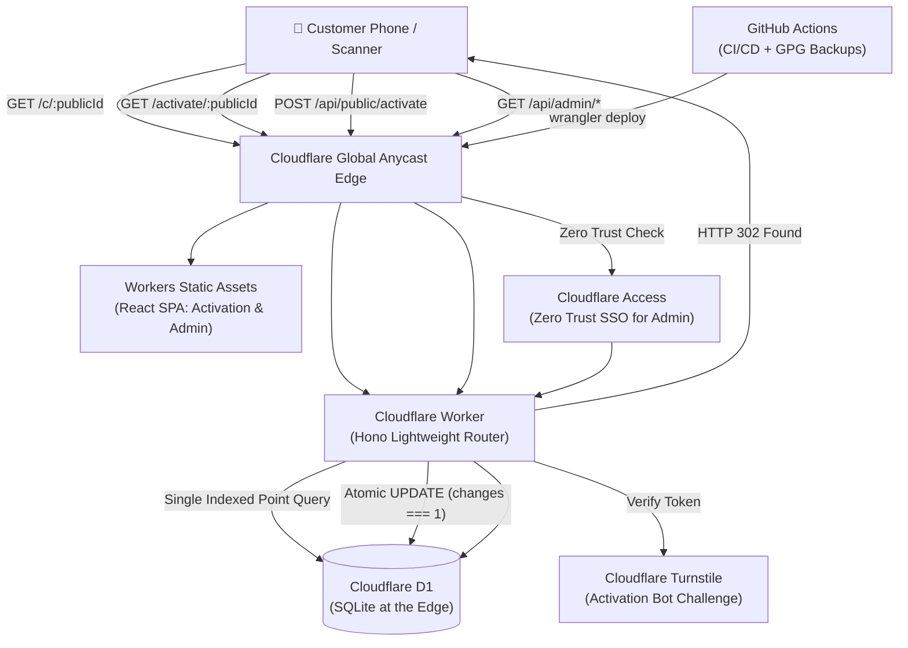
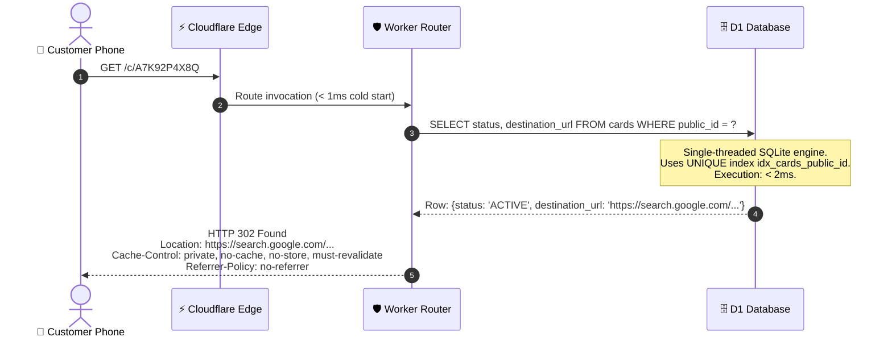
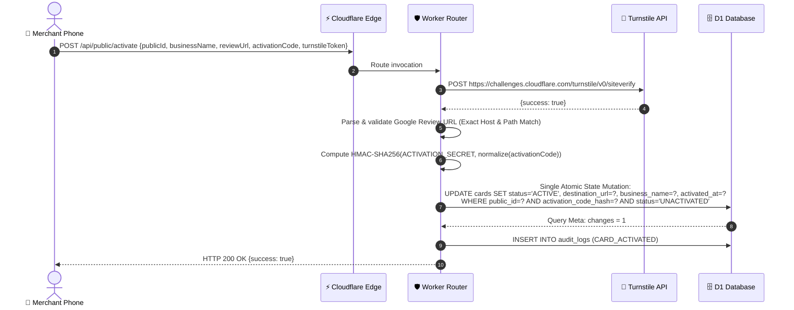

# 01 — System Design & Edge Architecture

> **Status:** Reconciled at Final Design Review (Gate 1.5). Implementation has NOT started.  
> **Core Runtime:** Cloudflare Workers + Hono + Cloudflare D1

---

## 1. System Architecture Overview



---

## 2. The Sacred Public Redirect Path (`GET /c/:publicId`)

The redirect critical path is intentionally minimal:
```
Request -> Worker -> Exactly One Indexed D1 Read -> State Check -> HTTP 302 Found
```



### Invariant Rules in the Critical Path:
1. **NO Scan Writes in Critical Path:** D1 write queries acquire write locks on SQLite. Incrementing scan counters during customer redirect would block concurrent reads and exhaust the 100k daily write quota. Scan counters are **NOT** updated during the 302 redirect.
2. **NO Analytics Engine / KV:** Zero external dependencies in the redirect flow.
3. **NO Outbound HTTP Requests on Customer Redirect:** Customer redirect requests make no outbound requests (Worker does not call Google or any external service). The activation flow performs the required server-side Cloudflare Turnstile Siteverify request (and never initiates outbound fetches to destination URLs).
4. **Latency Target:** Global p99 edge processing time $< 25$ ms.

---

## 3. Public Activation Flow (`POST /api/public/activate`)



---

## 4. Multi-Hostname Architecture & Seamless Domain Migration

The system natively supports multiple hostnames pointing to the same Cloudflare Worker:

```
[Old/Pilot URL]   https://qroute.workers.dev/c/A7K92P4X8Q  ──────+
                                                                |
                                                                v
[Future Brand]    https://qr.customdomain.com/c/A7K92P4X8Q ───► [Same Cloudflare Worker]
                                                                │
                                                                ▼
                                                        [D1 Point Lookup]
                                                                │
                                                                ▼
                                                        [HTTP 302 to Google]
```

- Cloudflare Workers Free supports up to 100 Custom Domains per zone.
- During migration, both `workers.dev` and the owned custom domain resolve to the same Worker.
- Physical cards printed during the pilot will **never** need to be reprinted when adding an owned custom domain.
