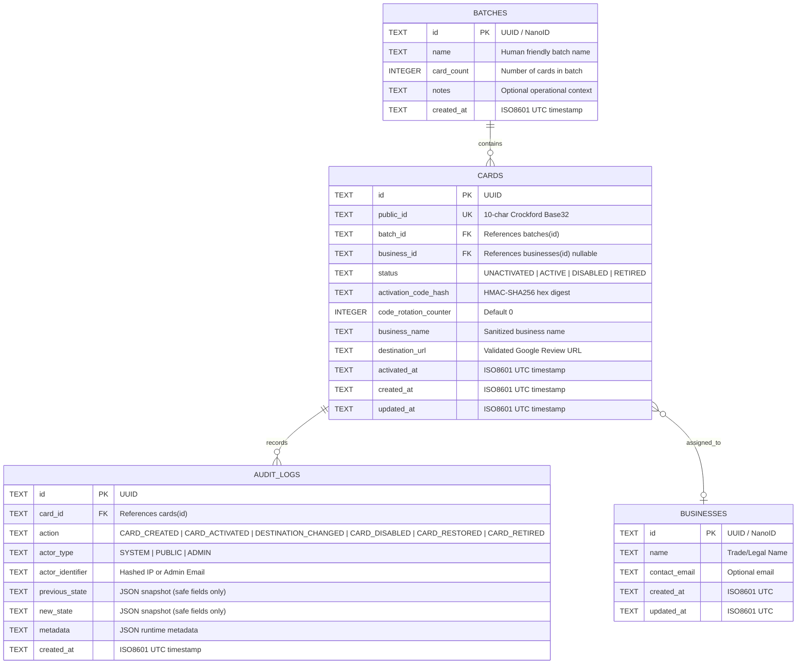

# 02 — Data Model & SQLite Architecture

> **Status:** Reconciled & Implemented (Milestones 1–4). Cloudflare D1 schema `migrations/0001_initial_schema.sql` verified with full relational integrity, foreign key constraints, and index coverage. See `docs/ADMIN_OPERATIONS.md`.  
> **Engine:** Cloudflare D1 (SQLite at the edge).  
> **Critical Engine Characteristic:** D1 is single-threaded per database instance. High-throughput performance relies entirely on zero-table-scan indexed point lookups.

---

## 1. Relational Schema Diagram (Mermaid)



---

## 2. DDL Schema Definition (`migrations/0001_initial_schema.sql`)

```sql
PRAGMA foreign_keys = ON;

-- 1. Batches Table
CREATE TABLE IF NOT EXISTS batches (
    id TEXT PRIMARY KEY,
    name TEXT NOT NULL,
    card_count INTEGER NOT NULL CHECK (card_count > 0),
    notes TEXT,
    created_at TEXT NOT NULL DEFAULT (STRFTIME('%Y-%m-%dT%H:%M:%fZ', 'NOW'))
);

-- 2. Businesses Table (Optional Organization Layer)
CREATE TABLE IF NOT EXISTS businesses (
    id TEXT PRIMARY KEY,
    name TEXT NOT NULL,
    contact_email TEXT,
    created_at TEXT NOT NULL DEFAULT (STRFTIME('%Y-%m-%dT%H:%M:%fZ', 'NOW')),
    updated_at TEXT NOT NULL DEFAULT (STRFTIME('%Y-%m-%dT%H:%M:%fZ', 'NOW'))
);

-- 3. Cards Table
CREATE TABLE IF NOT EXISTS cards (
    id TEXT PRIMARY KEY,
    public_id TEXT NOT NULL UNIQUE,
    batch_id TEXT NOT NULL REFERENCES batches(id) ON DELETE RESTRICT,
    business_id TEXT REFERENCES businesses(id) ON DELETE SET NULL,
    status TEXT NOT NULL DEFAULT 'UNACTIVATED' CHECK (status IN ('UNACTIVATED', 'ACTIVE', 'DISABLED', 'RETIRED')),
    activation_code_hash TEXT NOT NULL,
    code_rotation_counter INTEGER NOT NULL DEFAULT 0,
    business_name TEXT,
    destination_url TEXT,
    activated_at TEXT,
    created_at TEXT NOT NULL DEFAULT (STRFTIME('%Y-%m-%dT%H:%M:%fZ', 'NOW')),
    updated_at TEXT NOT NULL DEFAULT (STRFTIME('%Y-%m-%dT%H:%M:%fZ', 'NOW'))
);

-- 4. Audit Logs Table
CREATE TABLE IF NOT EXISTS audit_logs (
    id TEXT PRIMARY KEY,
    card_id TEXT NOT NULL REFERENCES cards(id) ON DELETE RESTRICT,
    action TEXT NOT NULL CHECK (action IN (
        'CARD_CREATED',
        'CARD_ACTIVATED',
        'DESTINATION_CHANGED',
        'CARD_DISABLED',
        'CARD_RESTORED',
        'CARD_RETIRED'
    )),
    actor_type TEXT NOT NULL CHECK (actor_type IN ('SYSTEM', 'PUBLIC', 'ADMIN')),
    actor_identifier TEXT NOT NULL,
    previous_state TEXT,
    new_state TEXT,
    metadata TEXT,
    created_at TEXT NOT NULL DEFAULT (STRFTIME('%Y-%m-%dT%H:%M:%fZ', 'NOW'))
);

-- MANDATORY INDEXES: Guarantees zero-table-scan performance on single-threaded D1
CREATE UNIQUE INDEX IF NOT EXISTS idx_cards_public_id ON cards(public_id);
CREATE INDEX IF NOT EXISTS idx_cards_batch_id ON cards(batch_id);
CREATE INDEX IF NOT EXISTS idx_cards_status ON cards(status);
CREATE INDEX IF NOT EXISTS idx_audit_logs_card_id ON audit_logs(card_id);
CREATE INDEX IF NOT EXISTS idx_audit_logs_created_at ON audit_logs(created_at);
```

---

## 3. The Single-Threaded D1 Performance Invariant

1. **Point Lookup Guarantee:**
   Because SQLite processes transactions sequentially, the public redirect path must execute exclusively as an indexed point query:
   ```sql
   SELECT status, destination_url FROM cards WHERE public_id = ?;
   ```
   With `idx_cards_public_id`, SQLite traverses the B-Tree directly ($O(\log N)$) taking $< 2$ ms of CPU.
2. **Zero Full-Table Scans:**
   No query containing un-indexed `WHERE` clauses, full-text table scans, or cross-table join aggregations is permitted on the redirect path.
3. **No Redirect Writes:**
   All mutations (activations, destination changes) occur outside the customer scan redirect path. Customer scans perform strictly read operations.

---

## 4. Audit Log Privacy & Security Invariants

The `audit_logs` table must **NEVER** store:
- ❌ Plaintext activation codes
- ❌ HMAC secret keys (`ACTIVATION_SECRET`)
- ❌ Cloudflare Turnstile private keys
- ❌ Full Authorization bearer tokens or session cookies
- ❌ Unsanitized request bodies containing sensitive credentials

Permitted audit log fields include:
- `event_id`: Unique UUID.
- `card_id`: Internal card reference.
- `action`: One of the 6 canonical actions.
- `actor_type`: `SYSTEM`, `PUBLIC`, or `ADMIN`.
- `actor_identifier`: SHA256 hashed client IP (public) or authenticated email (admin).
- `previous_state` / `new_state`: Safe JSON snapshot (e.g. `{"status": "ACTIVE", "destination_url": "..."}`).
