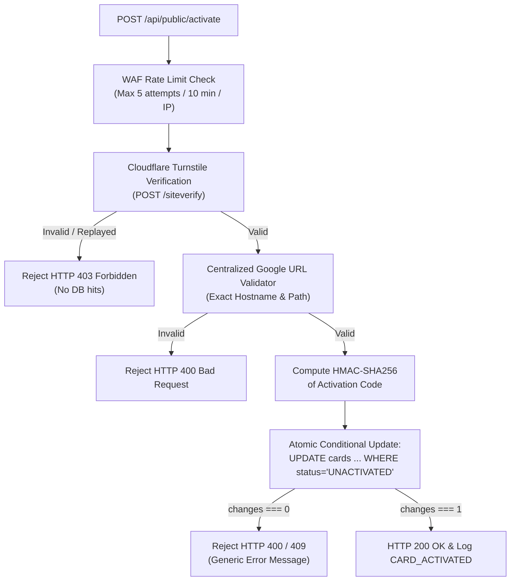

# 04 — Security Model & Cryptographic Architecture

> **Status:** Reconciled at Final Design Review (Gate 1.5). Core Redirect and Activation Cryptographic Pipeline Implemented & Verified in Milestones 2 & 3. See `docs/ACTIVATION_ENGINE.md`.  
> **Guiding Principle:** Defense-in-depth at \$0 cost with zero secret leakage.

---

## 1. Security Headers Policy

All responses emitted from the Cloudflare Worker runtime enforce the following headers:

```http
Content-Security-Policy: default-src 'self'; script-src 'self' https://challenges.cloudflare.com; frame-src https://challenges.cloudflare.com; style-src 'self' 'unsafe-inline'; font-src 'self'; img-src 'self' data:; connect-src 'self' https://challenges.cloudflare.com; object-src 'none'; base-uri 'none'; form-action 'self'; frame-ancestors 'none'; upgrade-insecure-requests;
Strict-Transport-Security: max-age=63072000; includeSubDomains; preload
X-Content-Type-Options: nosniff
X-Frame-Options: DENY
Referrer-Policy: strict-origin-when-cross-origin
Permissions-Policy: accelerometer=(), camera=(), geolocation=(), gyroscope=(), magnetometer=(), microphone=(), payment=(), usb=()
Cross-Origin-Opener-Policy: same-origin
Cross-Origin-Resource-Policy: same-origin
```

*Redirect Header Invariant:* When emitting `302 Found` on `/c/:publicId`, the Worker overrides referrer to `Referrer-Policy: no-referrer` and caches to `Cache-Control: private, no-cache, no-store, must-revalidate`.

---

## 2. Activation Code Cryptographic Design

### Requirements
- **Entropy & Generation:** 12 Crockford Base32 characters (`crypto.getRandomValues()`), grouped as `XXXX-XXXX-XXXX` for human readability.
- **Character Exclusion:** Excludes ambiguous glyphs (`I`, `L`, `O`, `U`) to eliminate physical transcription mistakes.
- **Never in Plaintext:** The database **never** contains the raw activation code.
- **Derived Storage:** Stored exclusively as an HMAC-SHA256 hex digest:
  $$\text{Hash} = \text{HMAC-SHA256}(\text{ACTIVATION\_SECRET}, \text{Normalize}(\text{Code}))$$
- **Normalization:** Strips hyphens, whitespace, and forces uppercase prior to hashing:
  ```typescript
  export function normalizeActivationCode(raw: string): string {
    return raw.replace(/[-\s]/g, "").toUpperCase();
  }
  ```
- **Constant-Time Verification:** Compared using timing-safe comparisons to prevent side-channel timing attacks.

---

## 3. Activation Flow Security Guardrails



### Invariants After Activation:
1. **Irreversible State:** Status permanently transitions to `ACTIVE`. The public activation form will **never** accept submissions for this card again.
2. **Confidentiality:** Subsequent visitors scanning or attempting activation receive generic status responses and are **never** shown the existing business name, Google destination, or activation code.
3. **No Reassignment:** A card cannot be claimed or overwritten by another business through public flows.
4. **Zero Log Leaks:** Activation codes and secrets are scrubbed and never appear in error traces, console output, or audit logs.
