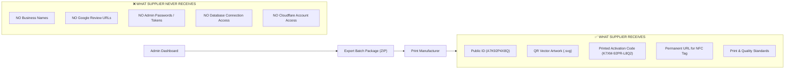

# 08 — Supplier Workflow & Zero-Knowledge Manufacturing

> **Status:** Reconciled at Final Design Review (Gate 1.5). Implementation has NOT started.  
> **Manufacturing Rule:** Zero-Knowledge Privacy. Suppliers never receive business identities or review destinations.

---

## 1. Zero-Knowledge Package Hand-Off



---

## 2. Supplier Data Manifest Schema (`manifest.csv`)

```csv
card_index,public_id,qr_file,printed_activation_code,nfc_url,substrate
1,A7K92P4X8Q,qr/A7K92P4X8Q.svg,K7XM-92PR-L8Q2,https://qr.example.com/c/A7K92P4X8Q,Matte PVC
2,B3W81N9L2P,qr/B3W81N9L2P.svg,P4RJ-18TM-Q5V9,https://qr.example.com/c/B3W81N9L2P,Matte PVC
```

*Privacy Verification:* Column headers `business_name`, `google_url`, and `destination_url` do not exist anywhere in the export artifact. The manufacturer prints blank, unactivated review cards.
