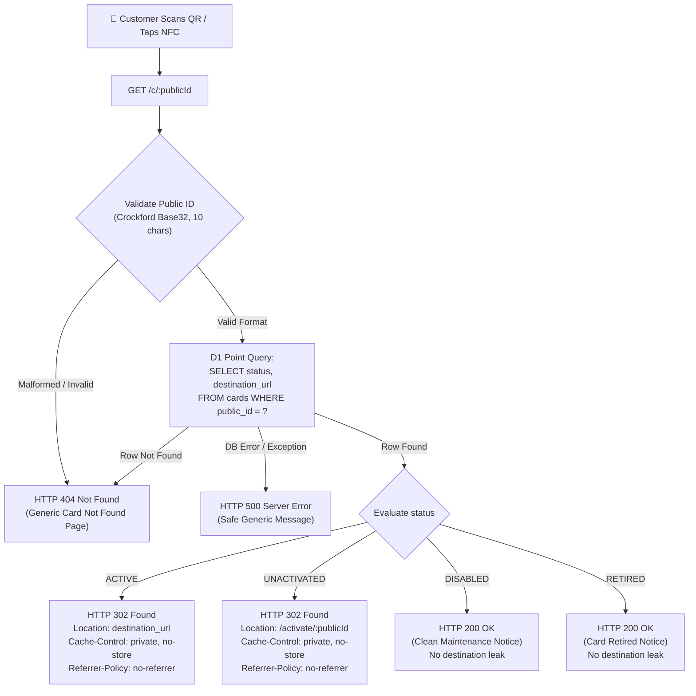

# QRoute Public Redirect Engine (`GET /c/:publicId`)

> **Component:** Edge Core Public Redirect Engine  
> **Status:** Implemented & Verified (Milestone 2)  
> **Runtime:** Cloudflare Workers + Hono + Cloudflare D1 (SQLite)  
> **SLA:** Edge processing compute $< 10$ ms (p99 $< 25$ ms)

---

## 1. Architectural Purpose & The Sacred Invariant

The public customer scan redirect path (`GET /c/:publicId`) is the most performance-critical and sacred runtime path of QRoute. Physical Google Review cards and NFC tags permanently encode this URL. It replaces costly commercial subscriptions with a \$0/month, permanent Cloudflare edge redirect engine that never locks cards.

```
Customer Scan ──► Cloudflare Edge Worker ──► Exactly ONE Indexed D1 Query ──► State Resolution ──► HTTP 302 Found
```

### The Prime Invariant:
1. **Exactly One Indexed D1 Read:** Normal redirect execution executes strictly one indexed point query:
   ```sql
   SELECT status, destination_url FROM cards WHERE public_id = ?;
   ```
2. **Zero Writes in Critical Path:** D1 write locks block concurrent reads. Scan-count increment writes and analytics writes are **strictly forbidden** from the redirect critical path.
3. **Zero Optional Dependencies:**
   - ❌ No Cloudflare Turnstile
   - ❌ No Analytics Engine / telemetry writes
   - ❌ No external Google API calls
   - ❌ No outbound HTTP `fetch()` requests (Zero SSRF risk)
   - ❌ No AI / LLM invocations
   - ❌ No email / notification dispatches
   - ❌ No Workers KV or Queues
   - ❌ No Admin dashboard dependencies
4. **Resilience Guarantee:** An outage of any non-critical service (admin UI, analytics, batch generator, monitoring, backup automation) causes **zero degradation** to already-`ACTIVE` card redirects.

---

## 2. Request Flow & State Machine



---

## 3. Public Identifier Validation

Public IDs are validated in memory **before** executing any D1 database lookup:

- **Alphabet:** Crockford Base32 (`0-9`, `A-Z`, excluding ambiguous glyphs `I`, `L`, `O`, `U`).
- **Length:** Exactly 10 characters (`^[0-9A-HJKMNP-TV-Z]{10}$`).
- **Normalization:** Trims whitespace and enforces uppercase.
- **Bounded Guard:** Inputs shorter than 10 or longer than 30 characters are immediately rejected, preventing regular expression Denial of Service (ReDoS) or memory spikes.
- **Zero Leakage:** Malformed IDs return the identical generic 404 response as non-existent cards, preventing identifier enumeration.

---

## 4. State Resolution & HTTP Response Specifications

| Card Status | HTTP Status | Response Header / Content | Privacy & Security Invariant |
|---|---|---|---|
| `ACTIVE` | `302 Found` | `Location: <destination_url>` | Destination passed directly in header without server-side validation or outbound fetch. |
| `UNACTIVATED` | `302 Found` | `Location: /activate/:publicId` | Directs merchant or scanner to activation shell without exposing internal codes. |
| `DISABLED` | `200 OK` | Swiss Design HTML maintenance notice (`"This review card is temporarily inactive. Please check back later."`) | Never exposes previous destination or business details. |
| `RETIRED` | `200 OK` | Swiss Design HTML retired notice (`"This card has been retired from service."`) | Terminal state. Card permanently inaccessible for public redirects. |
| `NOT_FOUND` / Malformed | `404 Not Found` | Swiss Design HTML 404 notice (`"Card not found. Please verify that you scanned an official review card."`) | Generic message. No database schema or card existence leakage. |
| Server / DB Error | `500 Server Error` | Safe generic notice (`"The request could not be processed. Please try again shortly."`) | Zero stack trace, table name, or D1 binding leakage. |

---

## 5. Caching & Security Header Policies

### Cache-Control Policy
All redirect and status responses emit:
```http
Cache-Control: private, no-cache, no-store, must-revalidate
```
*Rationale:* Physical card destinations are dynamic. If a merchant updates their review link or an administrator disables/retires a card, public redirect destinations must **never** remain cached in customer browser caches or intermediary CDN edges.

### Referrer Policy
All redirect responses emit:
```http
Referrer-Policy: no-referrer
```
*Rationale:* Customer scan origins and internal routing URLs must not be leaked in HTTP `Referer` headers when navigating to Google.

### Mandatory Baseline Security Headers
- `X-Content-Type-Options: nosniff`
- `X-Frame-Options: DENY`
- `Permissions-Policy: accelerometer=(), camera=(), geolocation=(), gyroscope=(), magnetometer=(), microphone=(), payment=(), usb=()`

---

## 6. HTTP Method Handling

| HTTP Method | Route | Response | Semantics |
|---|---|---|---|
| `GET` | `/c/:publicId` | State-driven response (302/200/404/500) | Full redirect engine execution. |
| `HEAD` | `/c/:publicId` | Identical status and headers as `GET`, empty body | Allows crawler and link-checker validation without payload download. |
| `OPTIONS` | `/c/:publicId` | `204 No Content`, `Allow: GET, HEAD, OPTIONS` | CORS preflight and method discovery. |
| `POST`, `PUT`, `PATCH`, `DELETE` | `/c/:publicId` | `405 Method Not Allowed`, `Allow: GET, HEAD, OPTIONS` | Mutation attempts strictly rejected. |

---

## 7. Security & Threat Mitigations

1. **Zero Open Redirect:** Destination URLs for `ACTIVE` cards are restricted to validated Google Review URLs established during activation or administrative update. The redirect engine does not accept unvalidated redirect parameters.
2. **Zero SSRF:** The Worker **never** performs server-side `fetch()` or socket connections to destination URLs. Redirection is delegated entirely to the client browser via standard HTTP `302 Found`.
3. **Zero SQL Injection:** All D1 queries utilize parameterized statements (`.prepare().bind(...)`). Dynamic string interpolation is banned.
4. **Zero Destination Leakage:** `destination_url` is returned strictly in `Location` on `ACTIVE` cards. `UNACTIVATED`, `DISABLED`, `RETIRED`, and `NOT_FOUND` cards never disclose previous or current destinations.
5. **No State Mutation:** Concurrent `GET` requests never modify card records or database state.

---

## 8. Verification & Test Coverage Matrix

The redirect engine is validated by comprehensive unit, integration, and E2E test suites:

- **Unit Suite (`tests/unit/utils.test.ts`):** 12 tests covering Crockford Base32 pattern compliance, ambiguous character rejection (`I`, `L`, `O`, `U`), whitespace trimming, case normalization, and injection attack rejection.
- **Integration Suite (`tests/integration/redirect.test.ts`):** 16 tests executing in the Miniflare/workerd environment:
  - `ACTIVE` 302 redirect to Google destination
  - `UNACTIVATED` 302 redirect to `/activate/:publicId`
  - `DISABLED` 200 maintenance notice without destination leakage
  - `RETIRED` 200 retired notice without destination leakage
  - `UNKNOWN` card 404 response
  - Malformed public ID rejection without D1 query execution
  - `POST`, `PUT`, `DELETE`, `PATCH` rejection with `405`
  - `HEAD` and `OPTIONS` method compliance
  - Simulated D1 error handling with safe 500 response
  - Server-side `fetch` spy asserting zero outbound SSRF calls
  - D1 prepare spy asserting **exactly one read** and **zero write queries**
  - Verification that observable database record is strictly unchanged
  - JSON `Accept` header handling for API callers
- **Playwright E2E Suite (`tests/e2e/redirect.spec.ts`):** 5 browser tests validating live redirects and Swiss Design status pages rendered by the local edge worker.
