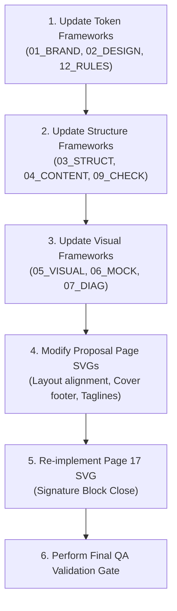

# Framework Alignment Report: LeadFlow Proposal (RC-1)

This report presents a Framework Alignment Audit to determine whether the proposal framework documents accurately reflect the final approved proposal (Pages 01–17) and maps which of the findings in `FINAL_QA_REPORT.md` are framework mismatches versus actual proposal defects.

---

# 1. Individual Framework File Audits

### 00_PROJECT_BRIEF.md
* **Alignment with Final Proposal:** **ALIGNED**
* **Outdated Sections:** None. Core values, scope, target audience, pricing (₹25,000 total initial cost + ₹2,000/month Support), and Progressive Web App positioning are perfectly aligned with the final proposal.
* **Sections to Update:** None.
* **Mismatches vs. Defects:** None.
* **Classification:** **No action required**

---

### 01_BRAND_GUIDELINES.md
* **Alignment with Final Proposal:** **PARTIALLY ALIGNED**
* **Outdated Sections:**
  - **Brand Promise / Tagline (Line 83):** Specifies that the tagline `Manage recruitment. Empower teams. Track progress.` should appear consistently across the proposal. It is completely missing from all 17 pages.
  - **Border Radius (Line 429):** Specifies a card corner radius of `16px`. However, the actual SVGs use `rx="12"` and `rx="8"`.
* **Sections to Update:**
  - Update the card corner radius token to align with `rx="12"` and `rx="8"`.
  - Relax the requirement for the brand tagline to allow flexible placement, or note it as an optional marketing asset.
* **Mismatches vs. Defects:**
  - **Defect (Proposal update required):** The missing brand tagline on the Cover page and Executive Summary.
  - **Mismatch (Framework update required):** The `16px` corner radius specification, which contradicts the actual generated SVG layouts.
* **Classification:** **Framework update required & Proposal update required**

---

### 02_DESIGN_SYSTEM.md
* **Alignment with Final Proposal:** **MISALIGNED**
* **Outdated Sections:**
  - **Margins (Line 69):** Specifies Left/Right margins of `64px` and Top margin of `72px`. However, `12_PAGE_GENERATION_RULES.md` and all 17 page SVGs use left margin `42pt` and right margin `553pt` (content width `511pt`).
  - **Grid System (Line 83):** Mentions a maximum content width of `1200px` and a 12-column layout. A width of `1200px` is copy-pasted from web design rules and cannot physically scale to an A4 Portrait page (`595pt` width).
  - **Card System (Line 269):** Repeats the card radius of `16px`, which does not match the actual SVG dimensions.
* **Sections to Update:**
  - Update margins to `42pt` left and right, and change width metrics to match the `595pt × 842pt` A4 layout.
  - Remove all web-based `1200px` width references.
  - Update card corner radius to `12pt`/`8pt`.
* **Mismatches vs. Defects:**
  - **Mismatch (Framework update required):** The `64px` margins and `1200px` content width are copy-paste artifacts in the design system document. The proposal correctly followed the A4 print dimensions.
* **Classification:** **Framework update required**

---

### 03_PROPOSAL_STRUCTURE.md
* **Alignment with Final Proposal:** **MISALIGNED (CRITICAL)**
* **Outdated Sections:**
  - **Pages 08–17 (Lines 270–535):** The structure defined in this file completely mismatches the final approved pages. It expected technical topics (Platform Features, Security & Roles, Technical Architecture, Deliverables Checklist, Future Roadmap) and a formal signature block. The actual pages focus on business-oriented workflow comparisons, ROI, and support.
* **Sections to Update:**
  - Update the description, objectives, and visuals of Pages 08–17 to match the actual approved proposal:
    * Page 08: Lead Management Table
    * Page 09: Executive Analytics Dashboard
    * Page 10: Mobile PWA Experience
    * Page 11: Implementation Journey (Roadmap timeline)
    * Page 12: Pricing & Engagement (Three-panel layout)
    * Page 13: Return on Investment (Workflow comparison & outcomes)
    * Page 14: Support & Long-Term Partnership (Lifecycle timeline)
    * Page 15: Why LeadFlow (Two-column comparison card)
    * Page 16: Next Steps (4-stage implementation timeline)
    * Page 17: Thank You (Centered contact card)
* **Mismatches vs. Defects:**
  - **Mismatch (Framework update required):** The "Missing Technical Architecture", "Missing Security & User Roles", "Missing Deliverables Checklist", "Missing Future Roadmap", and "Pages are out of order" findings are **framework mismatches**. The proposal was intentionally simplified to be a business-first SaaS pitch, but this blueprint was never updated to reflect that change.
  - **Defect (Proposal update required):** The lack of a contractual signature block on Page 17 is a proposal defect—even a simplified business proposal requires a clear sign-off mechanism.
* **Classification:** **Framework update required**

---

### 04_CONTENT_STRATEGY.md
* **Alignment with Final Proposal:** **PARTIALLY ALIGNED**
* **Outdated Sections:**
  - **Narrative Flow (Line 41):** Still lists the old, technical page structure (1. Problem, 2. Business Impact, ..., 6. Key Capabilities (Security, Tech Stack), etc.).
  - **Terminology Lock-In (Line 87):** Bans the word "Candidate" for lead records. However, the final proposal uses the word "Candidate" in mockups (e.g. "Call Candidate", "Candidate Lead Details List") and descriptions to preserve natural sentence flow.
* **Sections to Update:**
  - Update the 9 narrative steps to align with the actual approved page titles.
  - Modify the Terminology section to allow the use of "Candidate" when describing the person being contacted in a phone queue context.
* **Mismatches vs. Defects:**
  - **Mismatch (Framework update required):** The narrative flow list and the strict ban on the word "Candidate" are framework mismatches. The proposal pages used natural language to describe calling actions.
* **Classification:** **Framework update required**

---

### 05_VISUAL_REQUIREMENTS.md
* **Alignment with Final Proposal:** **MISALIGNED (CRITICAL)**
* **Outdated Sections:**
  - **UI Mockups Mappings (Line 225):** Maps mockups to incorrect page numbers (e.g. maps Mobile PWA to Page 7 instead of Page 10; maps Analytics Dashboard to Page 10 instead of Page 09).
  - **Illustrations & Diagrams Mappings (Line 264):** Mismatches graphics 06 to 13 with actual pages (e.g. maps Graphic 08 Platform Architecture Diagram to Page 12, which is actually the Pricing page).
* **Sections to Update:**
  - Re-map and re-describe all visual assets (mockups and diagrams) to match their actual locations and visual layouts on Pages 08–17.
* **Mismatches vs. Defects:**
  - **Mismatch (Framework update required):** The mismatch of mockup page numbers and the fact that diagrams (like the Architecture diagram or Permission matrix) were not generated are framework mismatches. The visual brief was not synchronized with the final design choices.
* **Classification:** **Framework update required**

---

### 06_UI_MOCKUPS.md
* **Alignment with Final Proposal:** **PARTIALLY ALIGNED**
* **Outdated Sections:**
  - **Mockup Mappings (Line 21):** Maps `Mockup 04: Mobile PWA` to Page 7 (actual is Page 10) and `Mockup 06: Analytics` to Page 10 (actual is Page 09).
* **Sections to Update:**
  - Update the page number associations for the Mobile PWA, Analytics Dashboard, and Daily Report.
* **Mismatches vs. Defects:**
  - **Mismatch (Framework update required):** The incorrect page associations are framework mismatches. The mockups themselves align with the layout guidelines.
* **Classification:** **Framework update required**

---

### 07_DIAGRAMS.md
* **Alignment with Final Proposal:** **MISALIGNED**
* **Outdated Sections:**
  - **Page Mappings & Lists (Line 57):** Maps several diagrams (Diagram 03 Lead Lifecycle, 04 User Role Flow, 05 Lead Assignment, 06 Reporting, 09 Platform Architecture, 10 Authentication, 11 Implementation Timeline) to old page layouts. Most of these diagrams are not present as distinct SVG assets in the final approved pages.
* **Sections to Update:**
  - Update the list of diagrams to reflect the actual SVGs present in the proposal folders (e.g. the 6-stage roadmap on Page 11, the ROI workflow comparison card on Page 13, the support lifecycle timeline on Page 14, and the 4-stage next steps timeline on Page 16).
  - Remove references to non-generated diagrams.
* **Mismatches vs. Defects:**
  - **Mismatch (Framework update required):** The list of expected diagrams that were never rendered is a framework mismatch.
* **Classification:** **Framework update required**

---

### 09_CHECKLIST.md
* **Alignment with Final Proposal:** **MISALIGNED**
* **Outdated Sections:**
  - **Section 1: Proposal Flow & Narrative (Line 14):** Lists the 17 pages of the original expected structure (which includes Security, Technical Architecture, and Deliverables).
  - **Section 5: UI Mockups Verification (Line 67):** Lists incorrect page mappings for the Mobile PWA and Analytics mockups.
* **Sections to Update:**
  - Update the 17-page checklist to match the actual page titles.
  - Update the mockup verification page numbers.
* **Mismatches vs. Defects:**
  - **Mismatch (Framework update required):** The checklist is outdated because it was never updated to match the final structural simplification.
* **Classification:** **Framework update required**

---

### 10_CREATIVE_DIRECTION.md
* **Alignment with Final Proposal:** **PARTIALLY ALIGNED**
* **Outdated Sections:**
  - **Storytelling Rhythm (Line 107 & 342):** Dictates a rhythm of `Problem -> Insight -> Solution -> Platform -> Workflow -> Screens -> Business Value -> Implementation -> Investment -> Future Vision -> Approval`. The actual approved pages alter this sequence and introduce visual comparisons multiple times.
* **Sections to Update:**
  - Update the storytelling rhythm list to reflect the actual business-outcome flow.
  - Update page sequence recommendations to match the actual files.
* **Mismatches vs. Defects:**
  - **Mismatch (Framework update required):** The storytelling sequence mismatch is a framework mismatch.
  - **Defect (Proposal update required):** The visual rhythm breaking (redundant comparisons on Pages 02, 13, and 15) is a proposal defect, as it stalls narrative momentum.
* **Classification:** **Framework update required & Proposal update required**

---

### 11_PRODUCT_REFERENCE.md
* **Alignment with Final Proposal:** **ALIGNED**
* **Outdated Sections:** None. Core technology stack, product capabilities, wa.me WhatsApp launch, device dialer calling limits, and out-of-scope lists match the final proposal.
* **Sections to Update:** None.
* **Mismatches vs. Defects:** None.
* **Classification:** **No action required**

---

### 12_PAGE_GENERATION_RULES.md
* **Alignment with Final Proposal:** **PARTIALLY ALIGNED**
* **Outdated Sections:**
  - **Page References (Line 184 & 215):** Mentions the old page structure and references technical pages.
  - **Card styles (Line 157):** Dictates a `8pt` corner radius, while actual pages use `rx=12`.
* **Sections to Update:**
  - Update page structures and templates references.
  - Adjust card style radius token to `12pt`/`8pt` to reflect components.
* **Mismatches vs. Defects:**
  - **Mismatch (Framework update required):** Page structure rules and card radius tokens are framework mismatches.
  - **Defect (Proposal update required):** The vertical shift of the takeaway cards (`y=640` on Pages 12-17 vs `y=722` on Pages 04-11) and the lack of component reuse on Pages 01–03 are proposal defects.
* **Classification:** **Framework update required & Proposal update required**

---

# 2. Framework Mismatches vs. Proposal Defects

Reviewing the findings in `FINAL_QA_REPORT.md` through the lens of this alignment audit reveals which issues must be solved by changing the **Framework** (updating the rules to match the approved proposal) vs. changing the **Proposal** (fixing errors in the pages themselves).

### True Proposal Defects (Must fix in Proposal pages)
1. **Missing signature/approval blocks on Page 17:** A business proposal must have a sign-off mechanism. The current "Thank You" contact card is too casual.
2. **Page numbering and footer on Page 01 (Cover):** Cover pages should not have header/footer elements.
3. **Takeaway card vertical alignment jumping:** Moving takeaways from `y=722` (Pages 04-11) to `y=640` (Pages 12-17) is an layout defect.
4. **Takeaway component not reused on Pages 01–03:** These pages drew custom shapes instead of reusing `takeaway.svg`.
5. **Redundant comparisons on Pages 02, 13, and 15:** Repeating the manual workflow comparison three times stalls reading momentum.
6. **Mismatch in Page 14 header text:** Header text reads "Support & Partnership" but the page title is "Support & Long-Term Partnership".

### Framework Mismatches (Must fix by updating Framework files)
1. **Missing Technical Architecture Page:** The approved proposal does not require a technical architecture diagram. Update `03_PROPOSAL_STRUCTURE.md`.
2. **Missing Security & User Roles Page:** The approved proposal does not require a security permission matrix page. Update `03_PROPOSAL_STRUCTURE.md`.
3. **Missing Deliverables Checklist Page:** The approved proposal does not require a deliverables checklist. Update `03_PROPOSAL_STRUCTURE.md`.
4. **Missing Future Roadmap Page:** The approved proposal does not require a roadmap timeline. Update `03_PROPOSAL_STRUCTURE.md`.
5. **Layout margins conflict:** The actual layout of L=42, R=553 margins is correct. The framework (`02_DESIGN_SYSTEM.md`) must be updated to remove the `64px` and `1200px` references.
6. **Card radius token conflict:** Actual cards use `rx=12` and `rx=8`. Update `01_BRAND_GUIDELINES.md` and `02_DESIGN_SYSTEM.md` to remove `16px`.
7. **Diagram mappings:** Update `07_DIAGRAMS.md` and `05_VISUAL_REQUIREMENTS.md` to remove reference to non-generated diagrams.

---

# 3. Action Plan & Execution Roadmap

### 1. Framework Files to Update
* `01_BRAND_GUIDELINES.md` (Update card radius, relax tagline rule)
* `02_DESIGN_SYSTEM.md` (Update margins to 42pt/511pt content width, update card radius)
* `03_PROPOSAL_STRUCTURE.md` (Update 17-page index to match actual names and objectives)
* `04_CONTENT_STRATEGY.md` (Update narrative flow, allow "Candidate" terminology)
* `05_VISUAL_REQUIREMENTS.md` (Update mockup and diagram page mappings)
* `06_UI_MOCKUPS.md` (Update PWA and Analytics mockup page mappings)
* `07_DIAGRAMS.md` (Update diagrams list to match actual SVGs)
* `09_CHECKLIST.md` (Update checklist page titles and mockup mappings)
* `10_CREATIVE_DIRECTION.md` (Update storytelling rhythm sequence)
* `12_PAGE_GENERATION_RULES.md` (Update page structure rules and corner radius tokens)

### 2. Proposal Pages to Regenerate / Modify
* **Page 01:** Remove page numbering and footer text.
* **Page 12:** Add explicit payment terms (50% upfront, 50% on completion) to the investment card.
* **Page 14:** Update header text to match full title "Support & Long-Term Partnership".
* **Page 17:** Replace contact details layout with formal signature blocks for Suryavanshi Finserv and Bedant Arya Padhy.
* **Pages 12–17:** Align the takeaway card y-coordinate back to `y=722` and adjust visual component heights to prevent layout jumping.
* **Pages 01–03:** Re-implement takeaway layouts using the master `foreignObject` takeaway component.
* **Page 15:** Remove the redundant "Current vs. LeadFlow" comparison block and replace it with a unique visual or card set.

### 3. Recommended Execution Order

1. **Step 1: Update design tokens in guidelines** (`01_BRAND_GUIDELINES.md`, `02_DESIGN_SYSTEM.md`, `12_PAGE_GENERATION_RULES.md`) to establish the correct margins (42pt) and corner radius (12pt/8pt).
2. **Step 2: Update structure blueprints** (`03_PROPOSAL_STRUCTURE.md`, `04_CONTENT_STRATEGY.md`, `09_CHECKLIST.md`, `10_CREATIVE_DIRECTION.md`) to align page titles and narrative sequences.
3. **Step 3: Update visual mappings** (`05_VISUAL_REQUIREMENTS.md`, `06_UI_MOCKUPS.md`, `07_DIAGRAMS.md`) to match mockups and diagram folders.
4. **Step 4: Execute minor proposal page edits** (realign takeaway cards, remove cover footers, fix header title typos).
5. **Step 5: Execute major proposal page close rebuild** (redesign Page 17 SVG to include signature block inputs).
6. **Step 6: Run validation gates** on links, spacing, and terminology locks.
